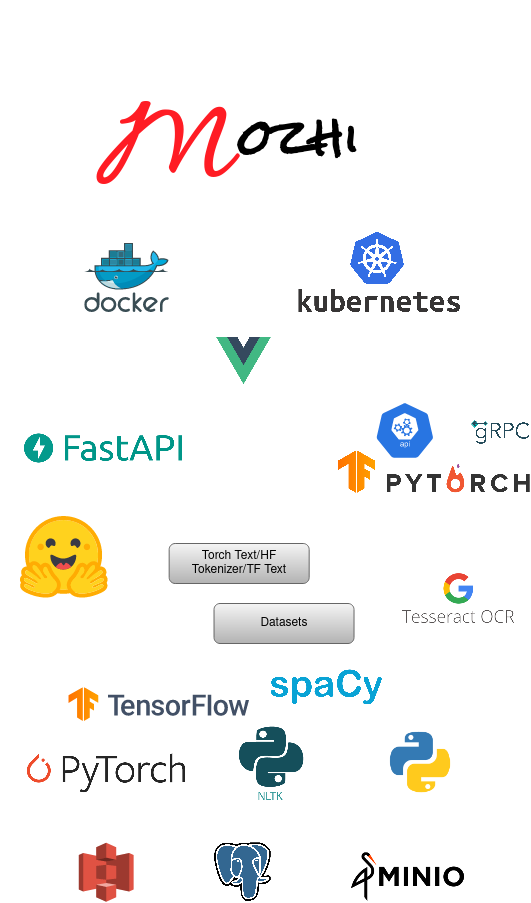

# Mozhi - A full stack for Named Entity Recognition tasks




## Contents

- [Features](features)
- [Developer Machine Setup](docs/source/setup/dev_machine.md)
- [How to run?](how)
- [Testing](testing)
- [Documentation](docs)

## [Features](#features)

- Web based NER Tagger using [Vue](vue.js)
  - Supports browser based tagging for text, csv, and parquet file formats
  - Persistent data support with PostgreSql database, along with build in tools to upload data
  - In-build support to tag images from object store
  - Comes with NER playground to load aviable models and test it
- Back-end engine using [FastAPI](https://fastapi.tiangolo.com/)
- Model serving using
  - Tensorflow serving
  - Pytorch serve
- Deep Learning Models
  - Dataset APIs
  - Well defined data preprocessor's
  - Minimal integration efforts for existing models
  - Support for developing custom Pytorch and Tensorflow models
  - Fully configurable training scripts


## [How to run the demo?](how)

- [Set up local Kubernets cluster using Minikube](docs/source/setup/on_minikune.md)
- Training Models (GPU is a must! Skip this part if you don't have a GPU and use prebuild models)
  - [Hugging Face Transformers Models](docs/source/setup/hf_model_training.md)
  - [Pytorch Models](docs/source/setup/pt_model_training.md) (Work In Progress)
  - [Tensorflow Models](docs/source/setup/tf_model_training.md) (Work In Progress)
- Load demo data by following the steps [here](docs/source/setup/prepare_data.md)
- Reference demo links
  - [Mozhi UI](mozhi.ai)
  - [Mozhi API](https://localhost:8088)
  - [MinIO](http://localhost:9000)
      - user: `mozhi`
      - password: `mozhi123`

## [Testing](#testing)

pytest flags:
- `s` #prints all logs to the terminal
- `rP` #shows the captured output of passed tests.
- `rx` #shows the captured output of failed tests (default behaviour).

```
export PYTHONPATH=$PYTHONPATH:$(pwd)/Mozhi/
export PYTHONPATH=$PYTHONPATH:$(pwd)/tests/

pytest -s 
```

## [Documentation](#docs)

**Build Documents**
```
export PYTHONPATH=$(pwd):$PYTHONPATH
cd docs
pip install -r requirements.txt
make Mozhi
```

## Misc

- In case if Postresql port is already in use: `systemctl stop postgresql`
- Port errors
```bash
# command to check port usage
export PORTNO=8088
sudo lsof -i -P -n | grep LISTEN | grep $PORTNO

#command to kill all running docker instances
docker kill $(docker ps -q) 
```
